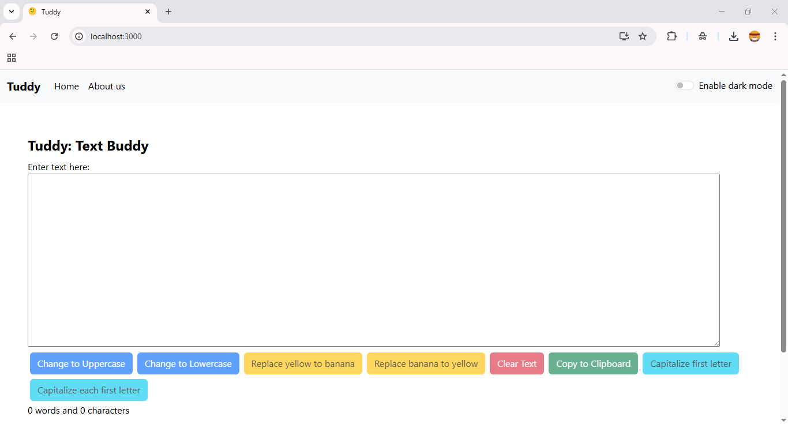
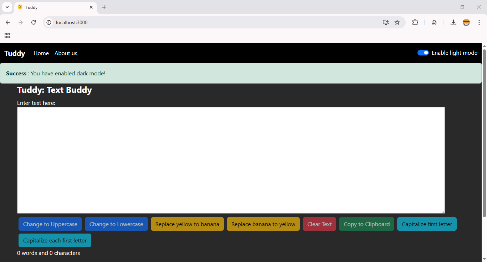
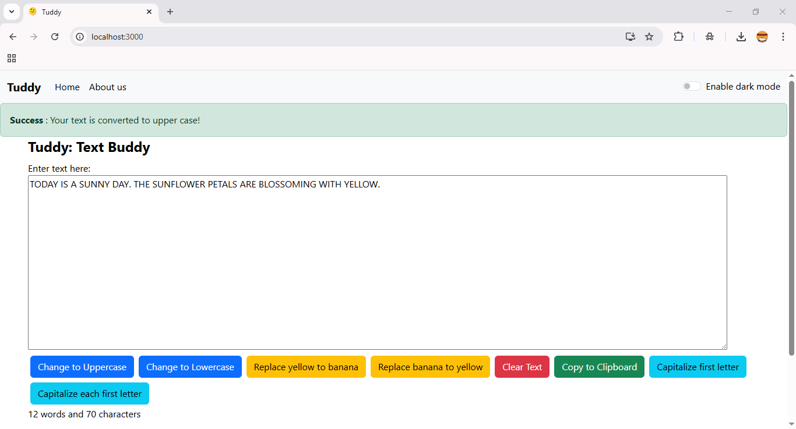
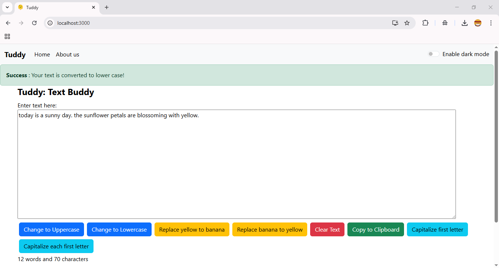
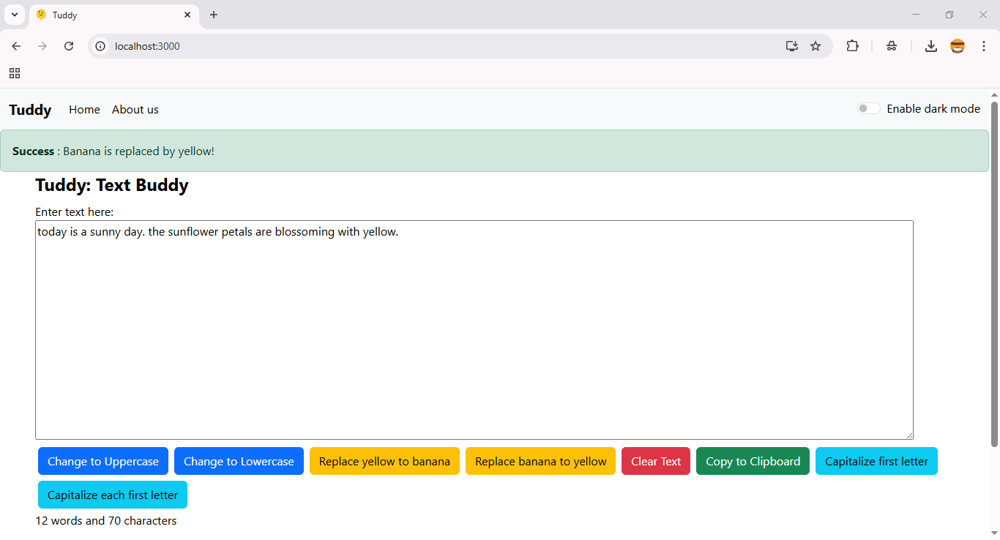

# My First React Project – Learning the Basics

This repository contains my **first hands-on project** built with React. It was developed as part of my learning journey to understand the fundamentals of React development, including components, state management, and routing.

## What I Learned

Through this project, I practiced and understood the following core React concepts:

- Creating **function-based components**
- **Importing and exporting** modules
- Handling **DOM events** like clicks
- Using the **`useState` hook** for state management
- Updating component state and re-rendering UI
- Integrating **Bootstrap** for styling
- Displaying **alert messages** based on user interactions
- Setting up **routing with `react-router-dom`**

## Technologies Used
- React
- JavaScript
- Bootstrap
- React Router DOM
- VS Code

## Screenshots

> Below are some screenshots of the project showcasing key features:

### Home

The main layout with a navbar and Bootstrap styling.

### About Us

Navigation between pages using `react-router-dom`. 

### Handling Events

Buttons that trigger alert messages when clicked, demonstrating the use of `useState` and event handling in React.

- **Dark Mode Toggle**
  
  Button that enables **dark mode** styling for the application when clicked.
  
 

- **Convert to Uppercase**
  
  Button that **converts the input text to uppercase** using a click event and updates the state accordingly.
  
 

- **Convert to Lowercase**

  Button that **converts the input text to lowercase** using a click event and updates the state accordingly.
  
 

- **Convert Yellow to Banana**

  Button that **converts yellow to banana** using a click event and updates the state accordingly.
  
 

- **Convert Banana to Yellow**

  Button that **converts banana to yellow** using a click event and updates the state accordingly.
  
 

## Acknowledgements

This project was created while following the **React JS tutorials by [CodeWithHarry](https://www.youtube.com/playlist?list=PLu0W_9lII9agx66oZnT6IyhcMIbUMNMdt)** on YouTube. Big thanks to him for creating beginner-friendly and engaging tutorials!

## Contact Me

Created by [Nitika Maharjan](https://github.com/NitikaMaharjan)

Feel free to connect with me on GitHub or reach out for collaboration!
